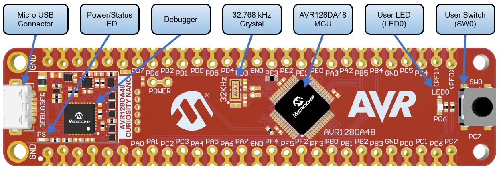
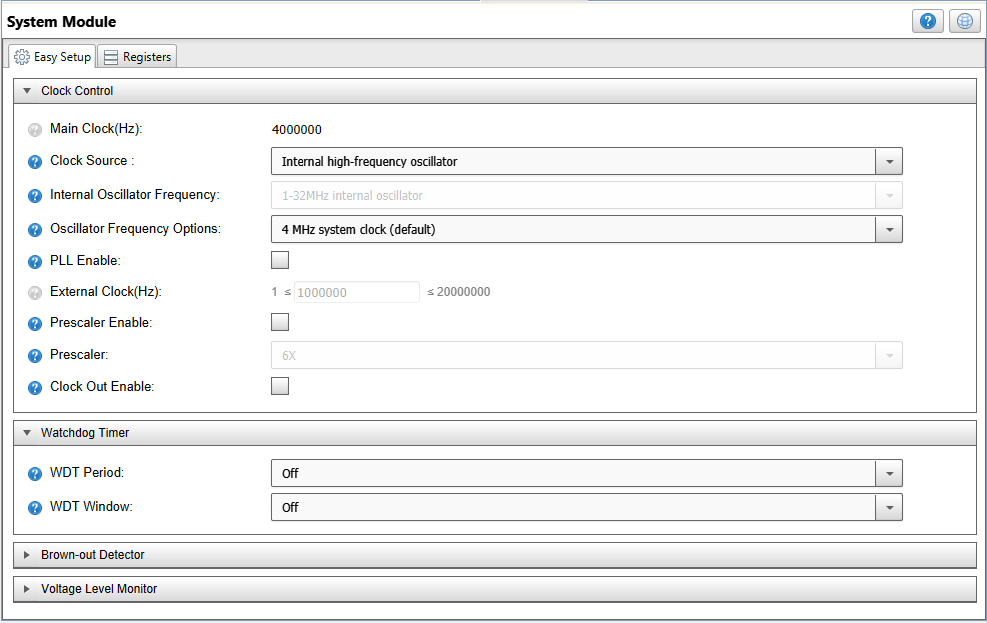
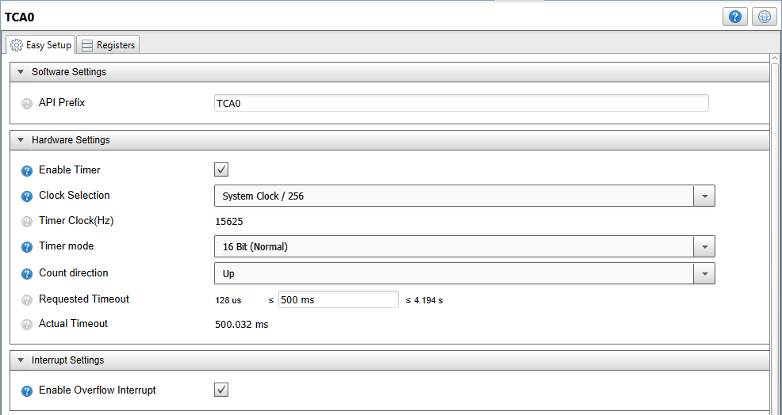
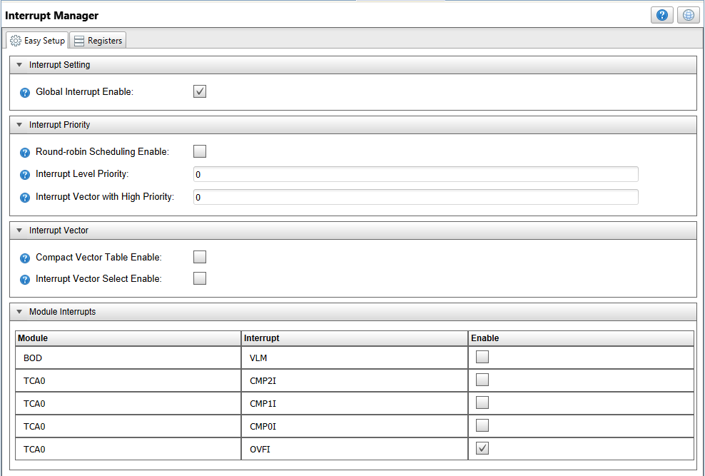
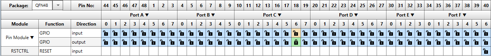
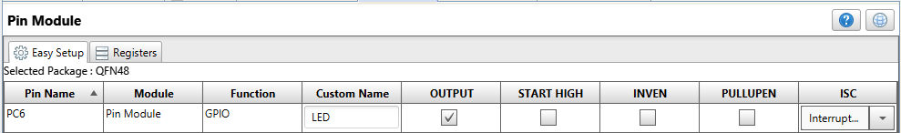
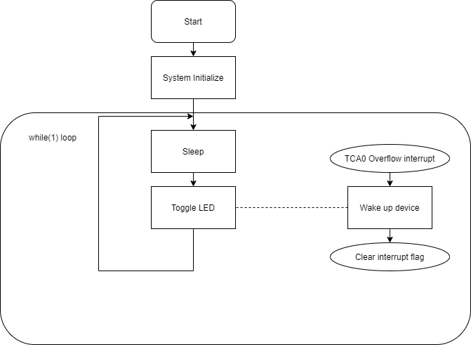

[](https://www.microchip.com)

# LED Blink with Sleep Operation

This repository provides an MPLAB X IDE project with an MCC (MPLAB Code Configurator) generated code example for blinking an LED where the microcontroller is in sleep state the rest of the time. 

## Related Documentation
More details and code examples on the AVR128DA48 can be found at the following links:
- [AVR128DA48 Product Page](https://www.microchip.com/wwwproducts/en/AVR128DA28)
- [AVR128DA48 Code Examples on GitHub](https://github.com/microchip-pic-avr-examples?q=avr128da48)
- [AVR128DA48 Project Examples in START](https://start.atmel.com/#examples/AVR128DA48CuriosityNano)

## Software Used
- MPLAB® X IDE 5.40 or newer [(microchip.com/mplab/mplab-x-ide)](http://www.microchip.com/mplab/mplab-x-ide)
- MPLAB® XC8 2.20 or newer [(microchip.com/mplab/compilers)](http://www.microchip.com/mplab/compilers)
- MPLAB® Code Configurator (MCC) 3.95.0 or newer [(microchip.com/mplab/mplab-code-configurator)](https://www.microchip.com/mplab/mplab-code-configurator)
- AVR-Dx_DFP 1.1.40 or newer Device Pack
- 8-bit AVR MCUs Lib version 2.3.0

## Hardware Used
- AVR128DA48 Curiosity Nano [(DM164151)](https://www.microchip.com/Developmenttools/ProductDetails/DM164151)

## Setup
The AVR128DA48 Curiosity Nano Development Board is used as test platform.
<br>

The following MCC configurations must be made for this project:

 - System Module
    1. Internal Oscillator (4 MHz)
    2. Prescaler disabled
    3. WDT disabled

<br>

- TCA0 
	1. System Clock/256
	2. 500 ms period
	3. Overflow Interrupt Enabled
	
<br>	
	
- Interrupt Manager
	1. Enable Global Interrupts
	
<br>	

- Pin Manager
    1. PC6 set as Digital output and named "LED".

<br>
<br>


## Demo Code 

The source code for this project can be downloaded from the current page by clicking the "Download" button, or if you want to make your own project, please pay attention to the following steps:
 - After making the MCC settings, press the "Generate" button, and this will generate the required .c and .h files.
 - Then edit the resulting code by adding the following code snippets.
    
	In the "main.c" file, replace the code with the following: 

    ```
	#include "mcc_generated_files/mcc.h"
	#include <avr/interrupt.h>
	#include <avr/sleep.h>

	int main(void)
	{
		/* Initializes MCU, drivers and middleware */
		SYSTEM_Initialize(); 

		while (1)
		{
			sleep_mode();
			LED_Toggle();
		}
	}
    ```

The flow diagram is presented in the picture below:

<br>

## Operation

1. Connect the AVR128DA48 Curiosity Nano Development Board to PC using the USB cable.
2. Build the firmware and load the generated hex file into MCU.  


## Demo:

After the code has been compiled and loaded onto the device, the on board LED should blink every second. It will be off half a second and on for another half a second.

## Summary
This example represents a simple LED blinking program where the microcontroller is in sleep until it is woken up by an interrupt and the LED is toggled.